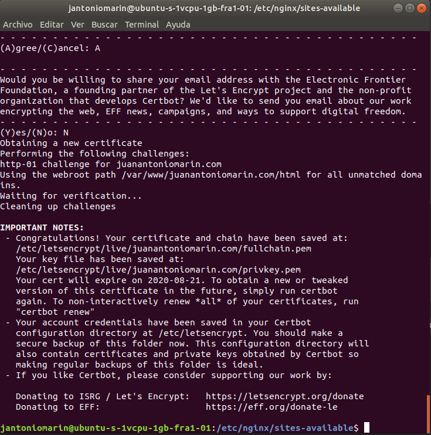

### Configuring nginx for SSL

#### In course.

`ls /var/www`

`mkdir /var/www/ssl`

`sudo touch /var/www/ssl/rest-api-course-trial.com.pem`

`sudo touch /var/www/ssl/rest-api-course-trial.com.key`

`sudo vi /var/www/ssl/rest-api-course-trial.com.pem`

paste cloudflare certificates.

`sudo vi /var/www/ssl/rest-api-course-trial.com.key`

again paste cloudflare certificates

`sudo vi /etc/nginx/sites-enabled/items-rest.conf`

Configuring this lines:

`listen 443 default_server;`

`server_name juanantoniomarin.com;`

`ssl on;`

`ssl_certificate /var/www/ssl/juanantoniomarin.com.pem;`

`ssl_certificate_key /var/www/ssl/juanantoniomarin.com.key;`

In other server block
```
server {
    listen 80;
    server_name juanantoniomarin.com;
    rewrite ^/(.*) https://juanantoniomarin.com/$1 permanent;
}
```

Add to firewall

`sudo ufw allow https`

`sudo ufw reload`

`sudo sytemctl reload nginx`

`sudo sytemctl restart nginx`

#### In my server generate the keys.

`sudo apt-get update`

`sudo apt-get install letsencrypt`

`sudo vi /etc/nginx/sites-available/juanantoniomarin.com`

Add this to server

```
location ~ /.well-known {
                allow all;
        }
```

`sudo letsencrypt certonly -a webroot --webroot-path=/var/www/juanantoniomarin.com/html -d juanantoniomarin.com -d www.juanantoniomarin.com`

Enter email for recoverys and finish.



`sudo ls -l /etc/letsencrypt/live/juanantoniomarin.com/`

`sudo openssl dhparam -out /etc/ssl/certs/dhparam.pem 2048`

`sudo vi /etc/nginx/snippets/ssl-juanantoniomarin.com.conf`

```
ssl_certificate /etc/letsencrypt/live/juanantoniomarin.com/fullchain.pem;
ssl_certificate_key /etc/letsencrypt/live/juanantoniomarin.com/privkey.pem;
```

`sudo vi /etc/nginx/snippets/ssl-params.conf`

```
# from https://cipherli.st/
# and https://raymii.org/s/tutorials/Strong_SSL_Security_On_nginx.htmlssl_protocols TLSv1 TLSv1.1 TLSv1.2;
ssl_prefer_server_ciphers on;
ssl_ciphers "EECDH+AESGCM:EDH+AESGCM:AES256+EECDH:AES256+EDH";
ssl_ecdh_curve secp384r1;
ssl_session_cache shared:SSL:10m;
ssl_session_tickets off;
ssl_stapling on;
ssl_stapling_verify on;
resolver 8.8.8.8 8.8.4.4 valid=300s;
resolver_timeout 5s;
# Disable preloading HSTS for now.  You can use the commented out header line that includes
# the "preload" directive if you understand the implications.
#add_header Strict-Transport-Security "max-age=63072000; includeSubdomains; preload";
add_header Strict-Transport-Security "max-age=63072000; includeSubdomains";
add_header X-Frame-Options DENY;
add_header X-Content-Type-Options nosniff;ssl_dhparam /etc/ssl/certs/dhparam.pem;

```

Security copy for my previus configuration:

`sudo cp /etc/nginx/sites-available/juanantoniomarin.com /etc/nginx/sites-available/juanantoniomarin.com.bak`


```
server {
        listen 443 ssl http2 default_server;
        listen [::]:443 ssl http2 default_server;

        include snippets/ssl-juanantoniomarin.com.conf;
        include snippets/ssl-params.conf;
        server_name juanantoniomarin.com www.juanantoniomarin.com;

        # Web location
        location /{
                root /var/www/juanantoniomarin.com/html;
                index index.html index.htm;
        }

        location ~ /.well-known {
                root /var/www/juanantoniomarin.com/html;
                allow all;
        }
}

server {
        listen 80;
        server_name juanantoniomarin.com www.juanantoniomarin.com;
        rewrite ^/(.*) https://juanantoniomarin.com/$1 permanent;
}

```

`sudo ufw status`

`sudo ufw allow 'Nginx Full'`

`sudo ufw delete allow 'Nginx HTTP'`

Nginx Full for http and https.

5000 for API.

22/tcp for ssh.

```
To                         Action      From
--                         ------      ----
22/tcp                     ALLOW       Anywhere                  
5000                       ALLOW       Anywhere                  
Nginx Full                 ALLOW       Anywhere                  
22/tcp (v6)                ALLOW       Anywhere (v6)             
5000 (v6)                  ALLOW       Anywhere (v6)             
Nginx Full (v6)            ALLOW       Anywhere (v6) 
```

`sudo nginx -t`

`sudo systemctl restart nginx`

If you need renew certificate:

`sudo certbot renew`

or configure a Crontab (root user)

`crontab -e`

add this line:

`@weekly certbot renew && systemctl restart nginx`