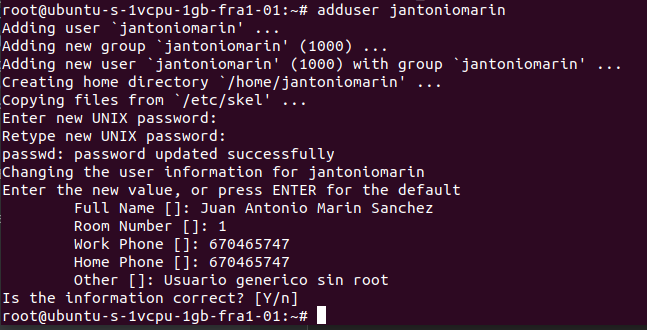
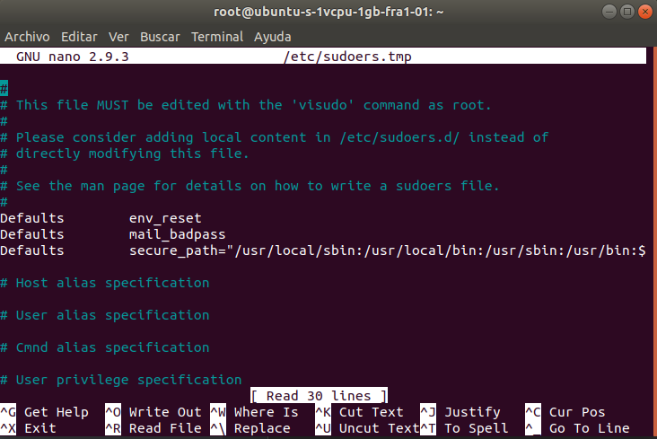
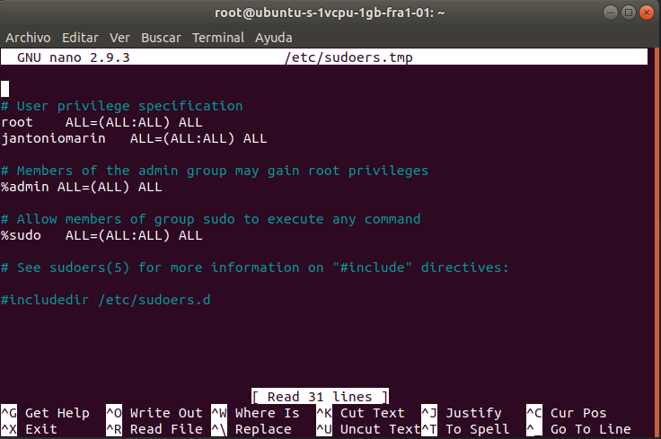
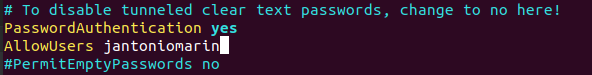

#### Add user
`adduser nameuser`

#### Change privilege for users

`visudo`

`nameuser   ALL=(ALL:ALL) ALL`

`vi /etc/ssh/sshd_config`

Press I for insert

`AllowUsers nameuser`

Press scape and :wq (write and quit) for save

`service ssh reload`
`exit`

And connect again.

`ssh jantoniomarin@yourip`

