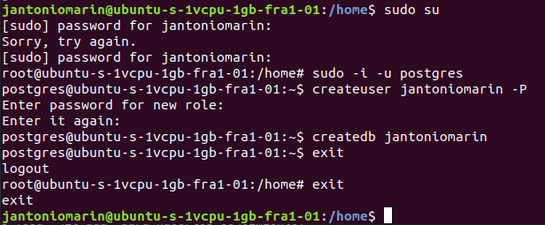
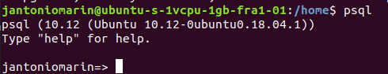
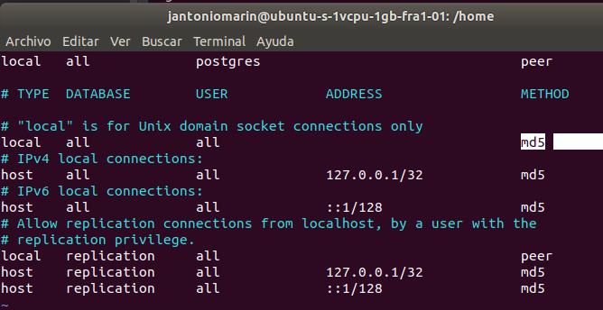

#### Connect with SSH

#### Create user

`sudo su`

Insert your password

`sudo -i -u postgres`

`createuser username -P`

Enter password 2 times

`createdb username`

`psql`

#### Change security database if you want (for more security)

`sudo vi /etc/postgresql/10/main/pg_hba.conf`

and change this:

