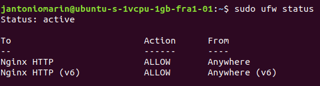
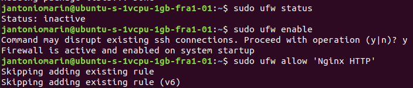
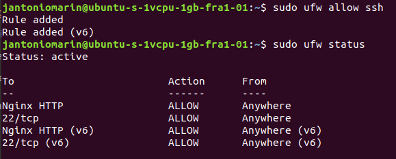

### Setting up nginx and our REST API

`sudo apt-get update`

`sudo apt-get install nginx`

`sudo ufw status`

`sudo ufw enable`

`sudo ufw allow 'Nginx HTTP'`



`sudo ufw status`



(Important)
`sudo ufw allow ssh`



`systemctl status nginx`


`sudo vi /etc/nginx/sites-available/items-rest.conf`

```server {
listen 80;
#GET juanantoniomarin.com:5645
real_ip_header X-Forwarded-For;
set_real_ip_from 127.0.0.1;
server_name localhost;

location / {
include uwsgi_params;
uwsgi_pass unix:/var/www/html/items-rest/socket.sock;
uwsgi_modifier1 30;
}

error_page 404 /404.html;
location = /404.html{
root /usr/share/nginx/html;
}

error_page 500 502 503 504 /50x.html;
location = /50x.html{
root /usr/share/nginx/html;
}
}
```

`sudo ln -s /etc/nginx/sites-available/items-rest.conf /etc/nginx/sites-enabled/`

`sudo mkdir /var/www/html/items-rest`

`sudo chown jantoniomarin:jantoniomarin /var/www/html/items-rest`

`cd /var/www/html/items-rest/`

`git clone https://github.com/JAntonioMarin/herokuApiFlask.git .`

`mkdir log`

`sudo apt-get install python-pip python3-dev libpq-dev`

`pip install virtualenv` (it's doesn't work for me)

use this:

`sudo apt-get install virtualenv`

`sudo apt-get install python3.7 python3.7-dev`

And continue:

`virtualenv venv --python=python3.7`

`source venv/bin/activate`

`pip install -r requirements.txt`